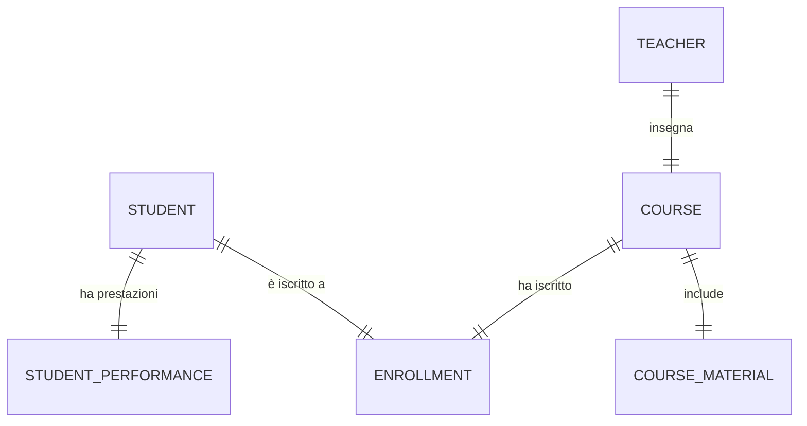
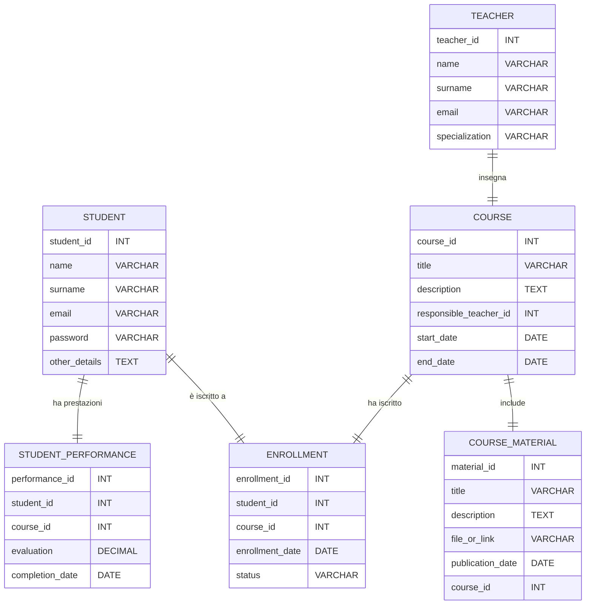
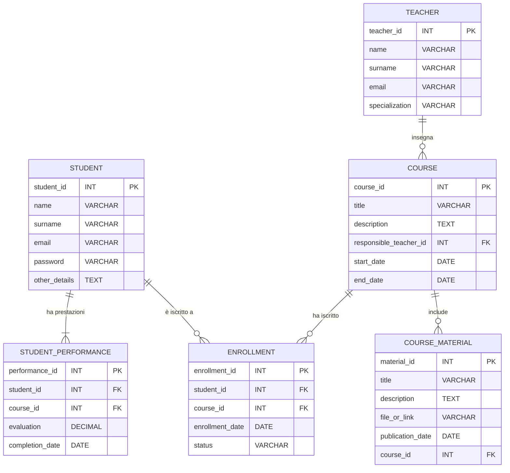

# Modello E/R

Prendiamo in considerazione un schema scheletro per iniziare:

```mermaid
erDiagram
    STUDENT ||--|| STUDENT_PERFORMANCE : "ha prestazioni"
    STUDENT ||--|| ENROLLMENT : "è iscritto a"
    COURSE ||--|| ENROLLMENT : "ha iscritto"
    TEACHER ||--|| COURSE : insegna
    COURSE ||--|| COURSE_MATERIAL : include
```

Stabilite le entità di base aggiungiamo gli attributi:

```mermaid
erDiagram
    STUDENT ||--|| STUDENT_PERFORMANCE : "ha prestazioni"
    STUDENT ||--|| ENROLLMENT : "è iscritto a"
    COURSE ||--|| ENROLLMENT : "ha iscritto"
    TEACHER ||--|| COURSE : insegna
    COURSE ||--|| COURSE_MATERIAL : include

    STUDENT {
        student_id INT
        name VARCHAR
        surname VARCHAR
        email VARCHAR
        password VARCHAR
        other_details TEXT
    }

    COURSE {
        course_id INT
        title VARCHAR
        description TEXT
        responsible_teacher_id INT
        start_date DATE
        end_date DATE
    }

    TEACHER {
        teacher_id INT
        name VARCHAR
        surname VARCHAR
        email VARCHAR
        specialization VARCHAR
    }

    COURSE_MATERIAL {
        material_id INT
        title VARCHAR
        description TEXT
        file_or_link VARCHAR
        publication_date DATE
        course_id INT
    }

    ENROLLMENT {
        enrollment_id INT
        student_id INT
        course_id INT
        enrollment_date DATE
        status VARCHAR
    }

    STUDENT_PERFORMANCE {
        performance_id INT
        student_id INT
        course_id INT
        evaluation DECIMAL
        completion_date DATE
    }
```

Adesso possiamo stabilire le chiavi e quindi le relazioni:

```mermaid
erDiagram
    STUDENT ||--|{ STUDENT_PERFORMANCE : "ha prestazioni"
    STUDENT ||--o{ ENROLLMENT : "è iscritto a"
    COURSE ||--o{ ENROLLMENT : "ha iscritto"
    TEACHER ||--o{ COURSE : insegna
    COURSE ||--o{ COURSE_MATERIAL : include

    STUDENT {
        student_id INT PK
        name VARCHAR
        surname VARCHAR
        email VARCHAR
        password VARCHAR
        other_details TEXT
    }

    COURSE {
        course_id INT PK
        title VARCHAR
        description TEXT
        responsible_teacher_id INT FK
        start_date DATE
        end_date DATE
    }

    TEACHER {
        teacher_id INT PK
        name VARCHAR
        surname VARCHAR
        email VARCHAR
        specialization VARCHAR
    }

    COURSE_MATERIAL {
        material_id INT PK
        title VARCHAR
        description TEXT
        file_or_link VARCHAR
        publication_date DATE
        course_id INT FK
    }

    ENROLLMENT {
        enrollment_id INT PK
        student_id INT FK
        course_id INT FK
        enrollment_date DATE
        status VARCHAR
    }

    STUDENT_PERFORMANCE {
        performance_id INT PK
        student_id INT FK
        course_id INT FK
        evaluation DECIMAL
        completion_date DATE
    }
```
