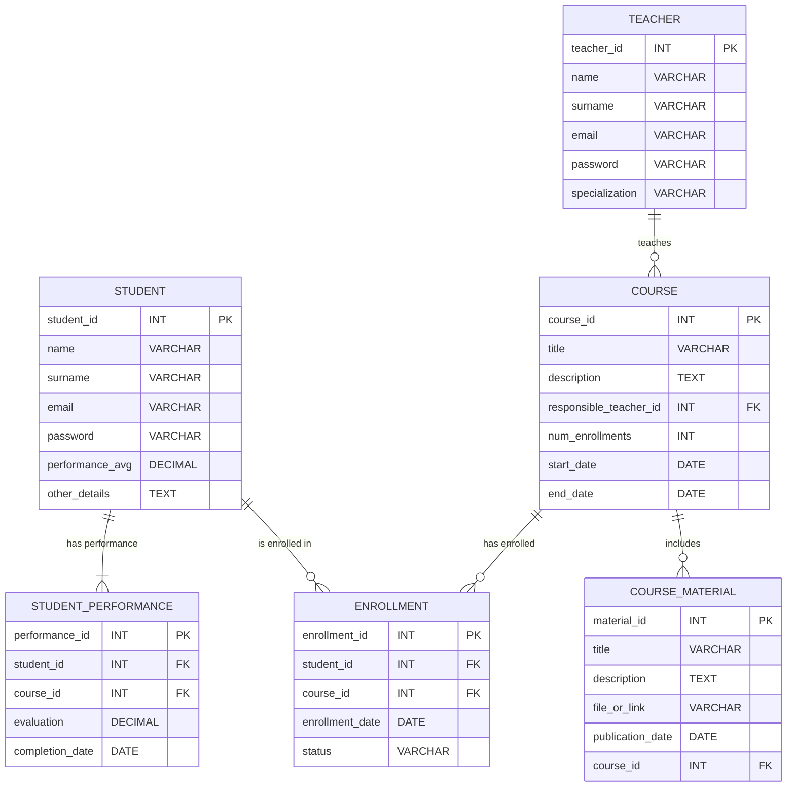

# Aggiornamento della Struttura del Database

In seguito alle considerazioni precedenti, apporteremo delle modifiche alla struttura del database per includere le ridondanze:

- **"num_enrollments"**: numero di iscritti al corso
- **"performance_avg"**: media dei voti dello studente

## Aggiornamento del Modello E/R

## Aggiornamento del Modello Logico

STUDENT (student_id PK, name, surname, email, password, performance_avg, other_details)\
COURSE (course_id PK, title, description, responsible_teacher_id FK, performance_avg, start_date, end_date)\
TEACHER (teacher_id PK, name, surname, email, password, specialization)\
COURSE_MATERIAL (material_id PK, title, description, file_or_link, publication_date, course_id FK)\
ENROLLMENT (enrollment_id PK, student_id FK, course_id FK, enrollment_date, status)\
STUDENT_PERFORMANCE (performance_id PK, student_id FK, course_id FK, evaluation, completion_date)

## Considerazioni

Le ridondanze che abbiamo aggiunto verranno gestite in automatico dal database, infatti più avanti vedremo l'implementazione di trigger che si occuperanno di aggiornare questi attributi
